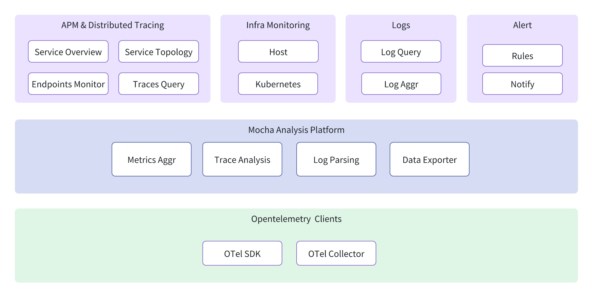
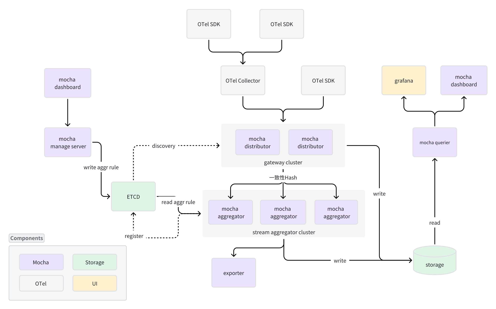

Mocha
=====

English | [简体中文](./README.zh-CN.md)

Mocha is an application performance monitor tools based on [OpenTelemetry](https://opentelemetry.io), which also provides a scalable platform for observability data analysis and storage.

**Note: Use `git clone --recursive` to clone this repository with submodules.**

## Quick Start
In the beta phase, we provide a Docker Compose file for users to experience our system locally.

+ [Quick Start](./docs/quick-start/docker-compose/quick-start.en-US.md)

## Features

Mocha follows an MVP approach: it starts from a minimal OpenTelemetry Trace pipeline and evolves toward a full observability platform. The diagram below shows the target functional architecture; the status of each capability is anchored to the [Roadmap](./docs/ROADMAP.md).

### Implemented (v0.1.0)

- OTLP Trace ingestion and storage (OTLP gRPC)
- OTLP Metrics ingestion and storage
- PromQL query engine (based on ANTLR4)
- Multi-backend storage abstraction (LiteDB / MySQL / InfluxDB)
- Jaeger-compatible query API
- Prometheus-compatible query API
- Grafana data source integration
- Docker Compose one-command deployment

### Planned (v2.0 / v3.0)

- Streaming aggregation platform with a DSL-based rule engine (`Mocha.Streaming` / Aggregator)
- Service topology and R.E.D metrics auto-aggregation
- Logs query and analysis
- Alerts: rule management and notifications
- Infrastructure monitoring: host, container, and Kubernetes
- Mocha Manager: management server, dashboard, and cluster metadata

## Technical Architecture

The components of Mocha are as follows:
- Mocha Distributor Cluster: As the gateway of the Mocha system, it is responsible for receiving data reported by OTel SDK and Collectors and routed them to the corresponding aggregator nodes through consistent hashing. To ensure data is not lost, the Distributor should eventually have the ability to locally store data in a FIFO queue.
- Mocha Streaming Cluster: The core component of Mocha, which generates corresponding streaming data flows and executes them by reading the pre-configured or user-configured aggr rule DSL. Streaming is a stateful component with the ability to distribute shuffled data and needs to register its information in ETCD.
- Storage: Mocha MTL storage, which can use open-source storage components such as ClickHouse, Elastic Search, and victoriametrics.
- Mocha Querier + Grafana: Querying data from storage and providing it to Grafana for display. Therefore, it is necessary to compatibility with promql/jeager/loki and other data sources.
- Mocha Manager : Consisting of a manager server, dashboard, and ETCD for cluster metadata and data analysis rules storage.
- OTel SDK / Collector : Open-source OpenTelemetry collection kits

## Documentation

- [Documentation Index](./docs/README.md) — quick start, user guide, architecture, and developer docs.
- [Roadmap](./docs/ROADMAP.md) — goals and status for v1.0 / v2.0 / v3.0.

## Contribute
One of the easiest ways to contribute is to participate in discussions and discuss issues. You can also contribute by submitting pull requests with code changes.

## License
Mocha is under the MIT license. See the [LICENSE](LICENSE) file for details.
