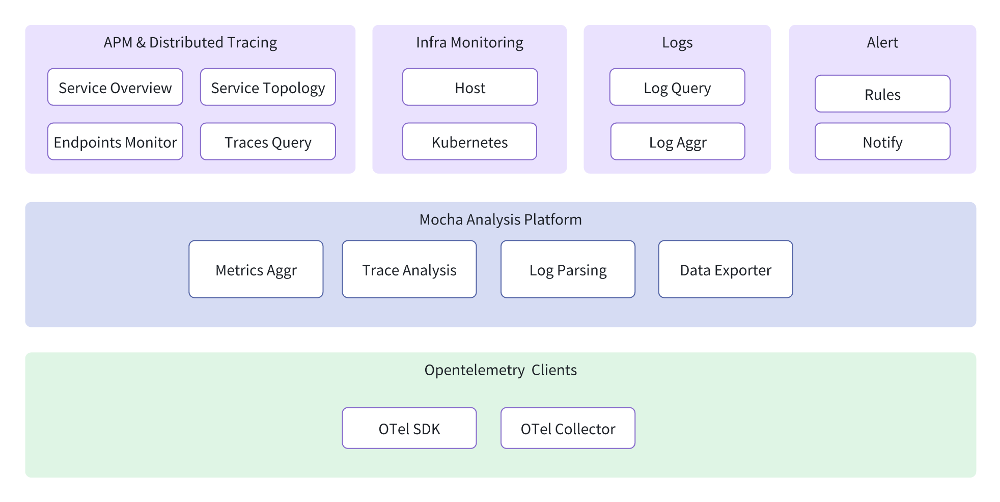
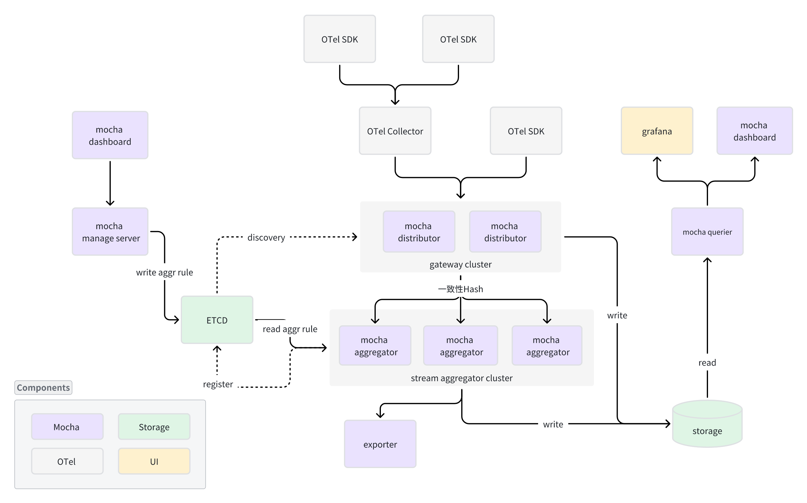

Mocha
=====

[English](./README.md) | 简体中文

Mocha 是一个基于 [OpenTelemetry](https://opentelemetry.io) 的 APM 系统，同时提供可伸缩的可观测性数据分析和存储平台。

**注意：使用 `git clone --recursive` 克隆本仓库以及子模块。**

## 快速开始
现阶段，我们提供了 Docker Compose 文件，方便用户在本地体验我们的系统。

+ [快速开始](./docs/quick-start/docker-compose/quick-start.zh-CN.md)

# 平台功能

Mocha 将要提供的功能集合：
- APM 和 分布式追踪
    - 服务概览、R.E.D 指标和可用性监控
    - 服务拓扑
    - 调用监控，包括 HTTP、RPC、Cache、DB、MQ 等
    - 调用链路查询和检索
- 基础设施监控
    - 主机监控
    - 容器和 Kubernetes 监控
    - 主流中间件监控
- 日志
    - 日志查询
    - 日志聚合分析
- 报警
    - 报警规则管理
    - 报警通知
- M.T.L 数据探索 [Data Explore / Inspect]

# 技术架构

Mocha 整体架构由下面的部分组成
- Mocha Distributor Cluster：作为 mocha 系统的数据入口，负责接收 OTel SDK 和 Collector 上报的数据，并通过一致性Hash 将数据路由到对应的 aggregator 节点上。为了保证数据不丢失，最终 Distributor 应该具备本地 FIFO 队列的能力。
- Mocha Streaming Cluster：mocha 的核心组件，通过读取预配置或者用户配置的 aggr rule dsl 生成对应的 streaming data flow 并执行。Streaming 是具备分布式 shuffle 的能力的有状态组件，需要将自身信息注册到ETCD中。
- Storage：mocha M.T.L 存储，可以选用开源存储组件，如 ClickHouse、ElasticSearch、victoriametrics 等。
- Mocha Querier + Grafana: 从存储查询数据并提供给 grafana 做展示。因此要兼容 promql / jeager / loki 等数据源的查询。
- Mocha Manager : 包括 manager server、dashboard和ETCE组件，集群元数据和 M.T.L 数据分析规则存储。
- OTel SDK / Collector : 开源 OpenTelemetry 采集套件。

## 参与贡献
参与贡献的最简单的方式是参与讨论并讨论问题。您也可以通过提交代码更改的拉取请求来进行贡献。

## 许可证
Mocha 是在 MIT 许可下发布的。有关详细信息，请参阅 [LICENSE](LICENSE) 文件。
