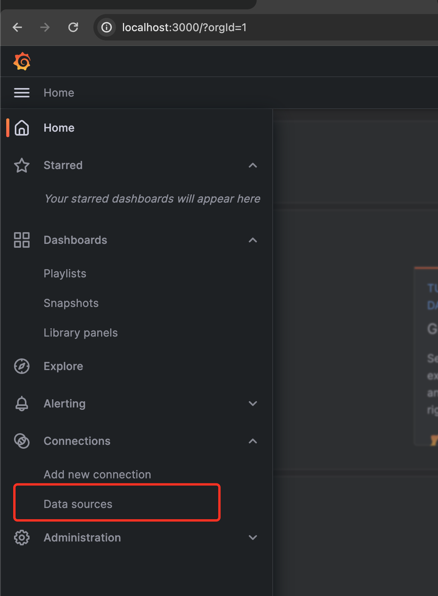
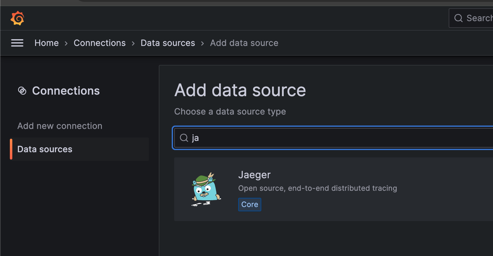
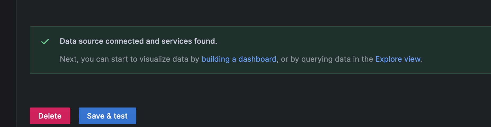
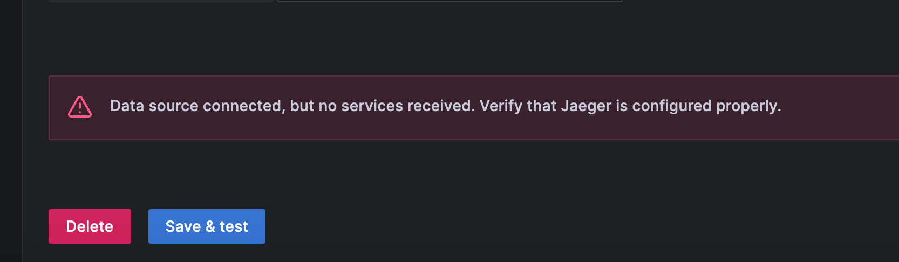
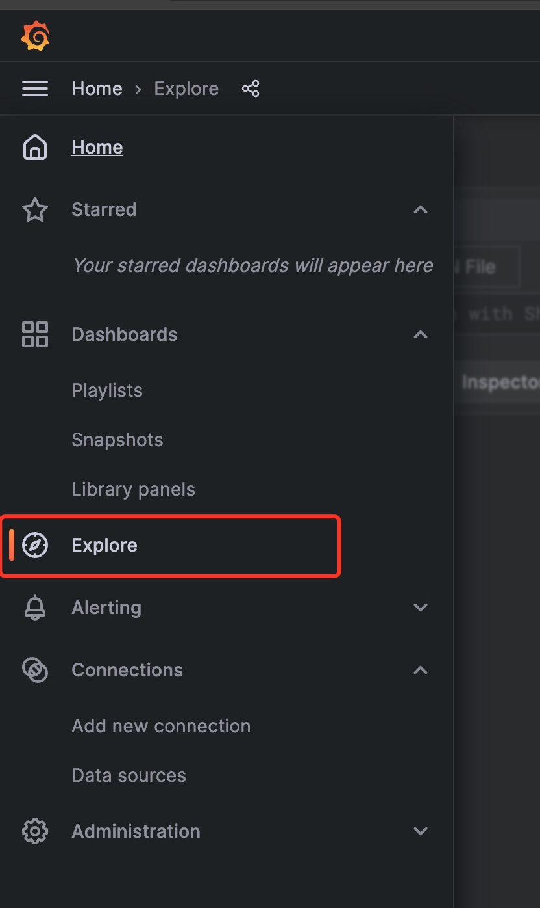
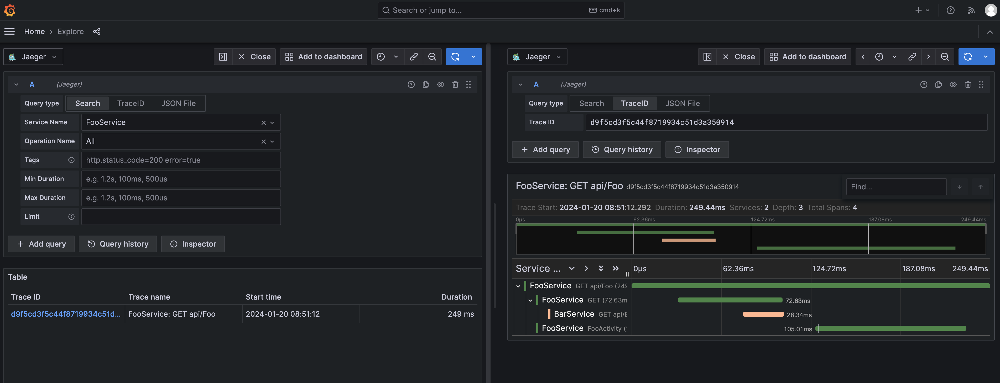

## Start the Project

Execute the following command in the docker directory under the project root directory to start the project:

```bash
docker-compose up -d
```

After the startup is successful, you can see the following containers:

+ distributor: Provides gRPC API for receiving OTLP data
+ jaeger-query: Provides HTTP API for receiving Jaeger query protocol
+ mysql: Used to store data
+ grafana: Used to display data

## Send Trace Data

Configure the OTLP exporter of the SDK as `http://localhost:4317` to send data to the distributor.

## Configure Jaeger Data Source

We have implemented an API that supports the Jaeger query protocol, so you can configure the Jaeger data source directly in Grafana.

Visit http://localhost:3000/ to see the grafana login page. Both the username and password are admin.

After logging in, click the menu on the left, select Data Sources, and then click Add data source.




Select Jaeger.


Configure the URL of the Jaeger data source as `http://query:5775/jaeger`.


Click Save & Test. If the following information is displayed, the configuration is successful.



If no data has been sent to the distributor yet, the following warning message will be displayed.



## Query Trace Data

Click the menu on the left, select Explore, and then select the Jaeger data source to see the Trace data.




