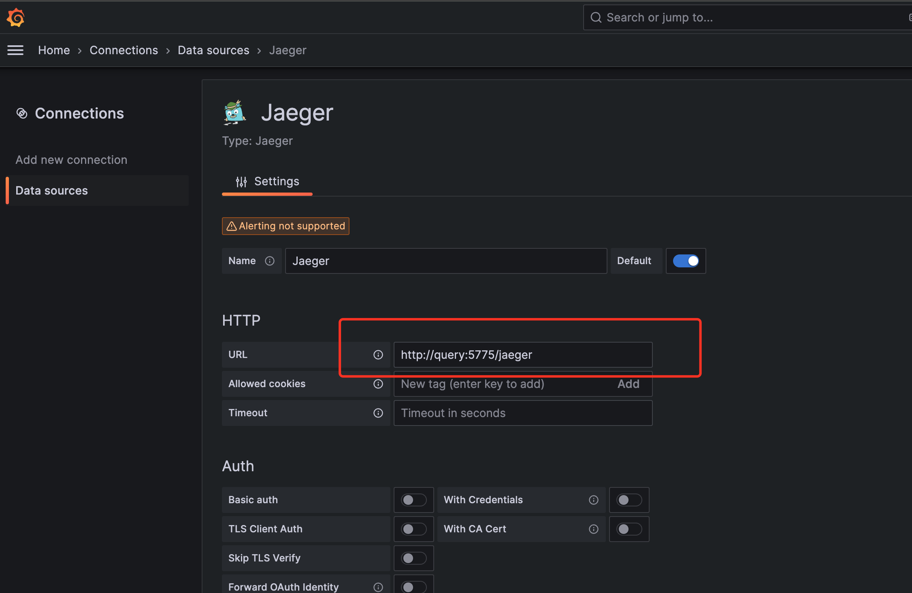
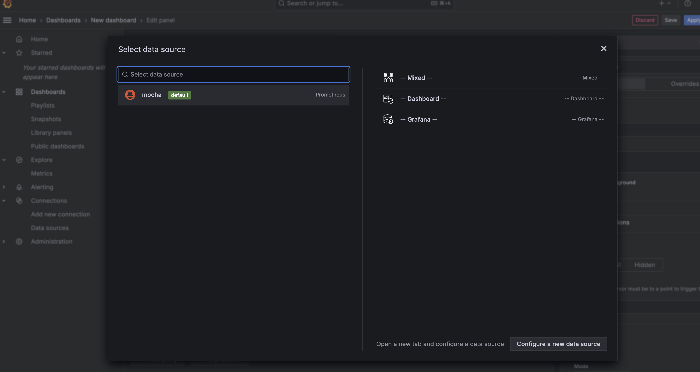

## Start the Project

Execute the following command in the docker directory under the project root directory to start the project:

```bash
docker-compose up --build -d
```

This version of storage is LiteDB, which is an embedded database, so there is no need to start additional database containers.

After the startup is successful, you can see the following containers:

+ mocha-distributor: Provides gRPC API for receiving OTLP data
+ mocha-query: Provides HTTP API for receiving query protocol
+ mocha-grafana: Used to display data

We have also implemented versions that store Tracing to MySQL and Metrics to InfluxDB.

You can execute `docker-compose -f docker-compose-mysql-influxdb.yml up --build -d` to start the version that uses MySQL and InfluxDB.

After the startup is successful, in addition to the above containers, you can also see the following containers:

+ mocha-mysql: Used to store data
+ mocha-influxdb: Used to store data

## Send Data

Configure the OTLP exporter of the SDK as `http://localhost:4317` to send data to the distributor.

## Query Data

Visit http://localhost:3000/ to see the grafana login page. Both the username and password are admin.

### Trace

#### Query Trace Data

We have implemented an API that supports the Jaeger query protocol, so you can configure mocha as a Jaeger data source in Grafana to query Trace data.

The Jaeger data source has been pre-configured in `docker/grafana/provisioning/datasources/mocha-datasources.yaml`.

Click the menu on the left, select Explore, and then select the mocha-tracing data source to see the Trace data.


#### Configure Jaeger Data Source

If you need to manually configure the Trace data source, you can refer to the following steps.

After logging in, click the menu on the left, select Data Sources, and then click Add data source.


Select Jaeger.


Configure the URL of the Jaeger data source as `http://query:5775/jaeger`.

The name of the data source can be customized. In this example, we use mocha-tracing.



Click Save & Test. If the following information is displayed, the configuration is successful.


If no data has been sent to the distributor yet, the following warning message will be displayed.


### Metrics

#### Query Metrics Data

We have implemented an API that supports the PromQL query protocol, so you can configure mocha as a Prometheus data source in Grafana to query Metrics data.

The Prometheus data source has been pre-configured in `docker/grafana/provisioning/datasources/mocha-datasources.yaml`.

Click the menu on the left, select Explore, and then select the Prometheus data source to see the Metrics data.


Click the menu on the left, select Dashboards, and then create a new dashboard.


Select the mocha-metrics data source that we just created.



After that, you can add panels as needed to display Metrics data.


#### Configure Prometheus Data Source

If you need to manually configure the Metrics data source, you can refer to the following steps.

After logging in, click the menu on the left, select Data Sources, and then click Add data source.

Select Prometheus.


Configure the URL of the Prometheus data source as `http://query:5775/prometheus`.

The name of the data source can be customized. In this example, we use mocha-metrics.


Configure the HTTP Method as POST.


Click Save & Test. If the following information is displayed, the configuration is successful.


