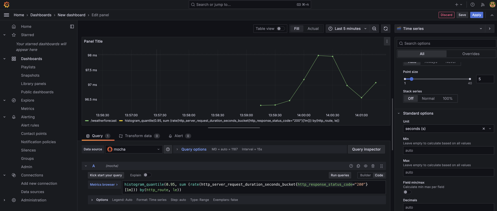

## Start the Project

Execute the following command in the docker directory under the project root directory to start the project:

```bash
docker-compose up --build -d
```

After the startup is successful, you can see the following containers:

+ distributor: Provides gRPC API for receiving OTLP data
+ query: Provides HTTP API for receiving query protocol
+ mysql: Used to store data
+ grafana: Used to display data

## Send Data

Configure the OTLP exporter of the SDK as `http://localhost:4317` to send data to the distributor.

## Query Data

### Trace

#### Configure Jaeger Data Source

We have implemented an API that supports the Jaeger query protocol, so you can configure the Jaeger data source directly in Grafana.

Visit http://localhost:3000/ to see the grafana login page. Both the username and password are admin.

After logging in, click the menu on the left, select Data Sources, and then click Add data source.


Select Jaeger.


Configure the URL of the Jaeger data source as `http://query:5775/jaeger`.


Click Save & Test. If the following information is displayed, the configuration is successful.


If no data has been sent to the distributor yet, the following warning message will be displayed.


#### Query Trace Data

Click the menu on the left, select Explore, and then select the Jaeger data source to see the Trace data.


### Metrics

#### Configure Prometheus Data Source

We have implemented an API that supports the PromQL query protocol, so you can configure the Prometheus data source directly in Grafana.

Visit http://localhost:3000/ to see the grafana login page. Both the username and password are admin.

After logging in, click the menu on the left, select Data Sources, and then click Add data source.

Select Prometheus.


Configure the URL of the Prometheus data source as `http://query:5775/prometheus`.


Configure the HTTP Method as POST.


Click Save & Test. If the following information is displayed, the configuration is successful.


#### Query Metrics Data

Click the menu on the left, select Explore, and then select the Prometheus data source to see the Metrics data.


Click the menu on the left, select Dashboards, and then create a new dashboard.


Select the Prometheus data source that we just created.


After that, you can add panels as needed to display Metrics data.




