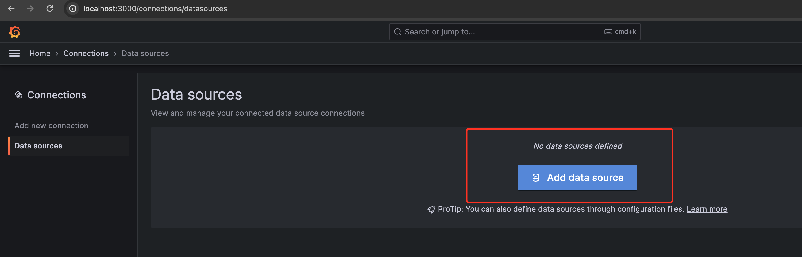
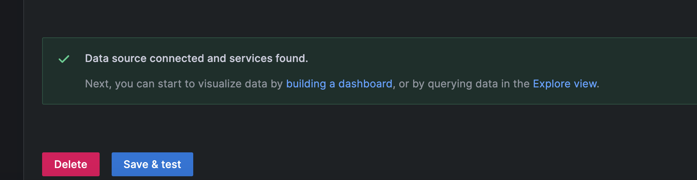
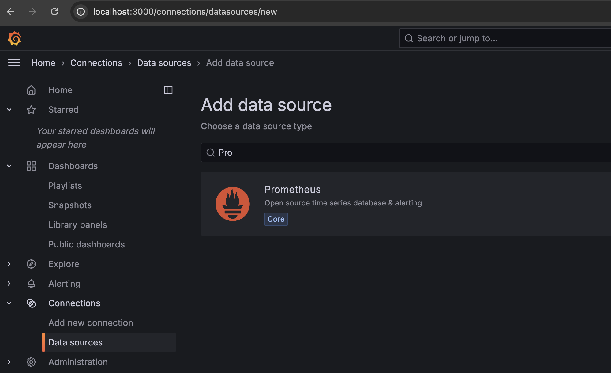
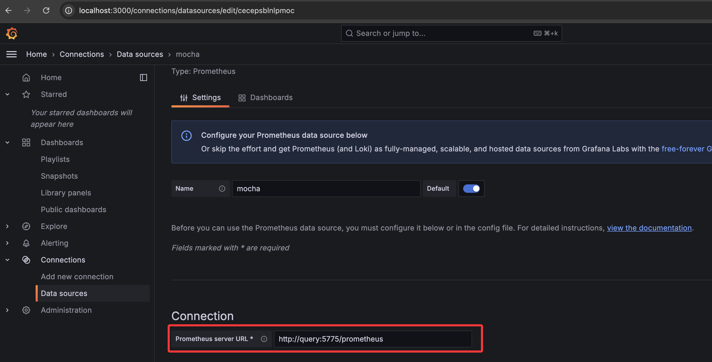
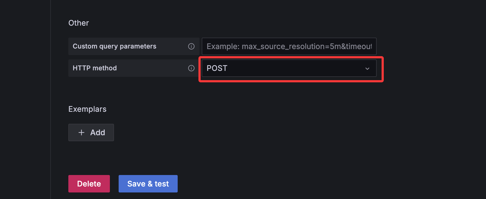
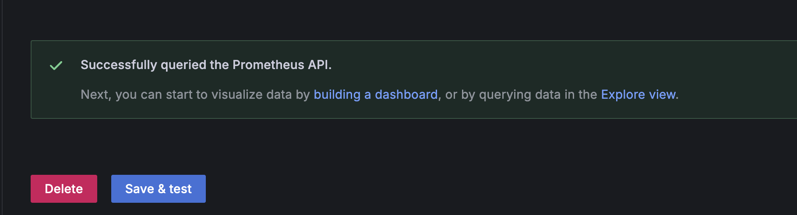
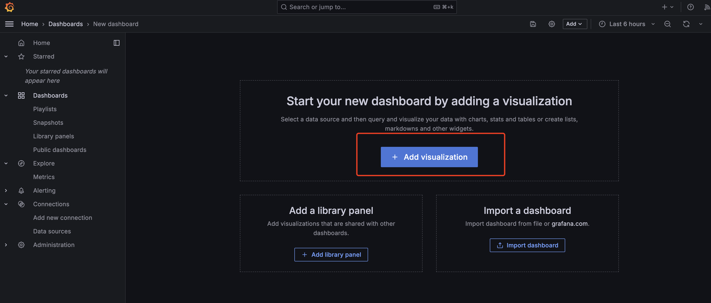

## 启动项目

在项目根目录下的docker目录中，执行以下命令启动项目：

```bash
docker-compose up --build -d
```

启动成功后，可以看到以下容器：

+ distributor: 提供用于接收 OTLP 数据的 gRPC API
+ query: 提供用于接收查询协议的 HTTP API
+ mysql: 用于存储数据
+ grafana: 用于展示数据

## 数据的发送

将 SDK 的 OTLP exporter 配置为 `http://localhost:4317` 即可将数据发送到 distributor。

## 数据的查询

### Trace

#### 配置 Jaeger 数据源

我们实现了支持 Jaeger 查询协议的 API，因此可以直接在 Grafana 中配置 Jaeger 数据源。

访问 http://localhost:3000/ 即可看到grafana的登录页面。用户名和密码都是admin。

登录后，点击左侧的菜单，选择 Data Sources，然后点击 Add data source。




选择 Jaeger。


配置 Jaeger 数据源的 URL 为 `http://query:5775/jaeger`。


点击 Save & Test，如果显示如下信息，则说明配置成功。



如果还没往 distributor 发送过数据，会显示如下警告信息。


#### Trace 数据的查询

点击左侧的菜单，选择 Explore，然后选择 Jaeger 数据源，即可看到 Trace 数据。


### Metrics

#### 配置 Prometheus 数据源

我们实现了支持 PromQL 查询协议的 API，因此可以直接在 Grafana 中配置 Prometheus 数据源。

访问 http://localhost:3000/ 即可看到grafana的登录页面。用户名和密码都是admin。

登录后，点击左侧的菜单，选择 Data Sources，然后点击 Add data source。

选择 Prometheus。



配置 Prometheus 数据源的 URL 为 `http://query:5775/prometheus`。



配置 HTTP Method 为 POST。



点击 Save & Test，如果显示如下信息，则说明配置成功。



#### Metrics 数据的查询

点击左侧的菜单，选择 Explore，然后选择 Prometheus 数据源，即可看到 Metrics 数据。


点击左侧的菜单，选择 Dashboards，即可创建一个 Dashboard。




选择我们刚刚创建的 Prometheus 数据源。


接下来就可以根据需要添加 Panel，展示 Metrics 数据了。


