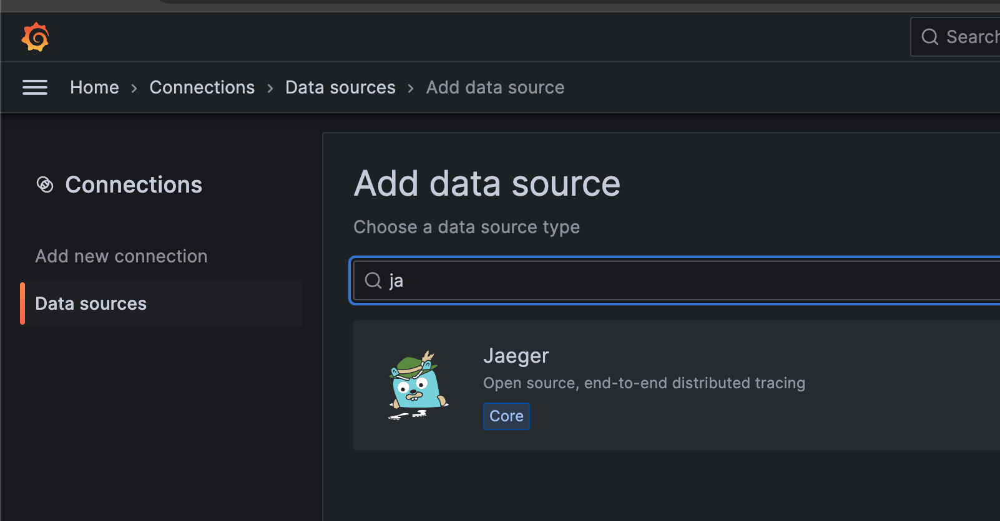

## 启动项目

在项目根目录下，执行以下命令启动项目：

```bash
docker-compose up -d
```

启动成功后，可以看到以下容器：

+ distributor: 提供用于接收 OTLP 数据的 gRPC API
+ jaeger-query: 提供用于接收 Jaeger 查询协议的 HTTP API
+ mysql: 用于存储数据
+ grafana: 用于展示数据

## Trace 数据的发送

将 SDK 的 OTLP exporter 配置为 `http://localhost:4317` 即可将数据发送到 distributor。

## Trace 数据的查询

我们实现了支持 Jaeger 查询协议的 API，因此可以直接在 Grafana 中配置 Jaeger 数据源。

访问 http://localhost:3000/ 即可看到grafana的登录页面。用户名和密码都是admin。

登录后，点击左侧的菜单，选择 Data Sources，然后点击 Add data source。


选择 Jaeger。


配置 Jaeger 数据源的 URL 为 http://jaeger-query:5775。


点击 Save & Test，如果显示如下信息，则说明配置成功。


这边建议先往 Distributor 发送一些数据，然后再点击 Save & Test，否则会报错。

